# Don's Table

"Don's Table" is built using Django, Python, JavaScript, HTML, CSS and PostgreSQL. It is hosted on Heroky.

To visit the deployed version of Don's Table : [click here.](https://dons-table-784bf0e01547.herokuapp.com/)

## Table of Contents

1. [Purpose](#1-purpose).
2. [Users & Website Goals](#2-users--website-goals)
3. [Features](#3-features)
4. [Planning](#4-planning)
    4.1. [User Stories](#41-user-stories--epics)
    4.2. [Epics](#42-epics)
    4.3. [Sprints](#43-sprints)
    4.4. [Database Diagram](#44-database-diagram)
    4.5. [Project Structure](#45-project-structure)
    4.6. [Views, URLs and Templates](#46-views-urls-and-templates)
5. 
6. 

## 1. Purpose

Don's Table is an Italian-American restaurant offering a modern online reservation system. The full-stack web application enables guests to browse the menu, register for an account, and book tables online, while staff can manage reservations and menu items through a secure role-based dashboard.

The project goals are to:
- Provide a seamless, responsive booking experience for customers.
- Prevent overbookings through time-slot and maximum capacity limits.
- Offer guests a personal dashboard to view, edit, or cancel their reservations.
- Allow staff and admins to manage reservations, availability, and menu items efficiently.
- Deliver a consistent, user-friendly interface with a classic Italian-American aesthetic.

Target Audience: 

Families, couples, and food lovers seeking authentic Italian dining. The brand also appeals to fans of Italian-American pop culture thanks to its name, décor, and atmosphere.

## 2. Users & Website Goals

User Goals:
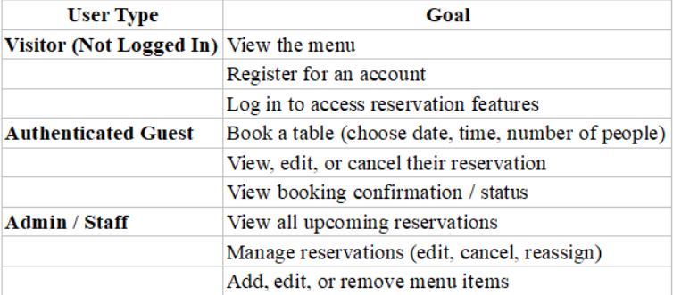

Website Goals: 
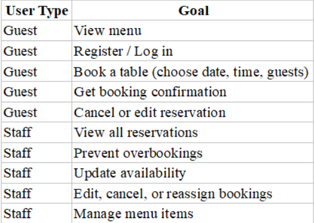

## 3. Features

- Header/Navbar: Allows users to navigate the website intuitively according to their role (visitor, logged-in user, or admin), displaying different navigation items and CTA buttons based on permissions. A small message in the header indicates whether the user is logged in and their username.
Notes: On smaller screens, the navbar collapses into a dropdown menu to ensure easy and accessible navigation.

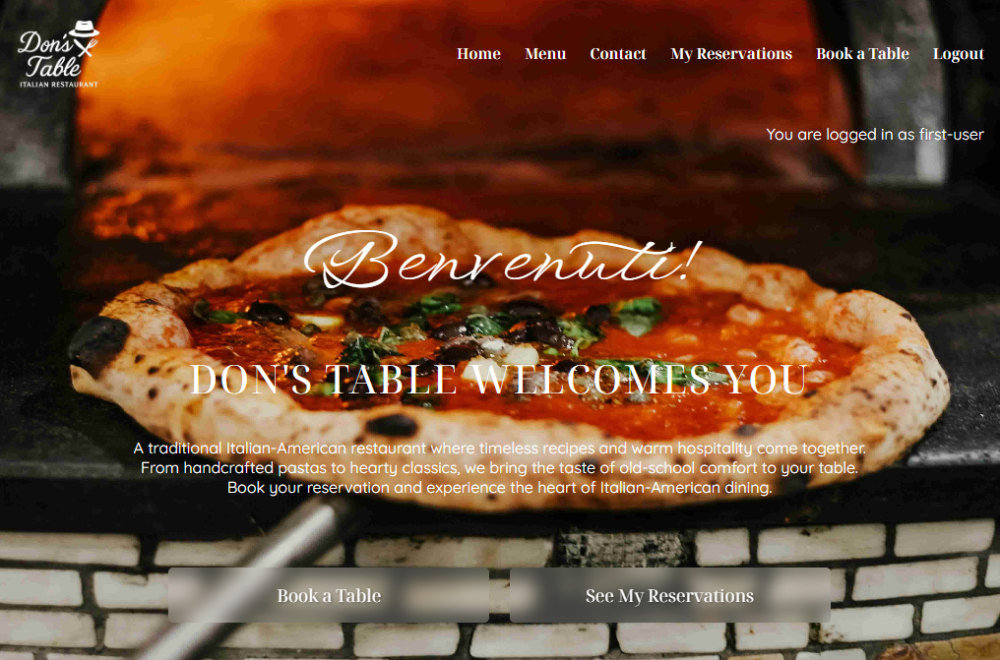

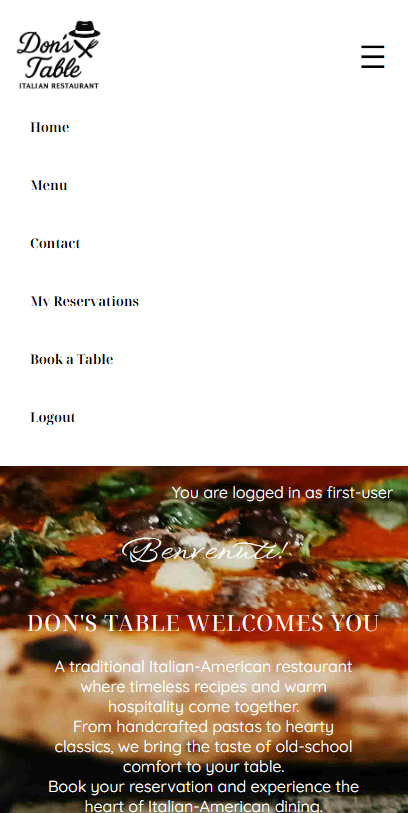

- User Registration, Login & Logout: Lets guests create accounts, log in to access booking features, and log out securely.
Notes: Form validation ensures users provide correct and complete information.
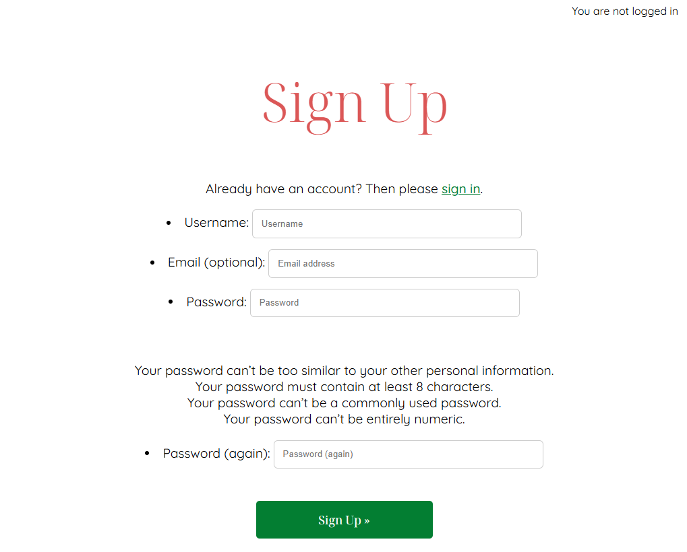
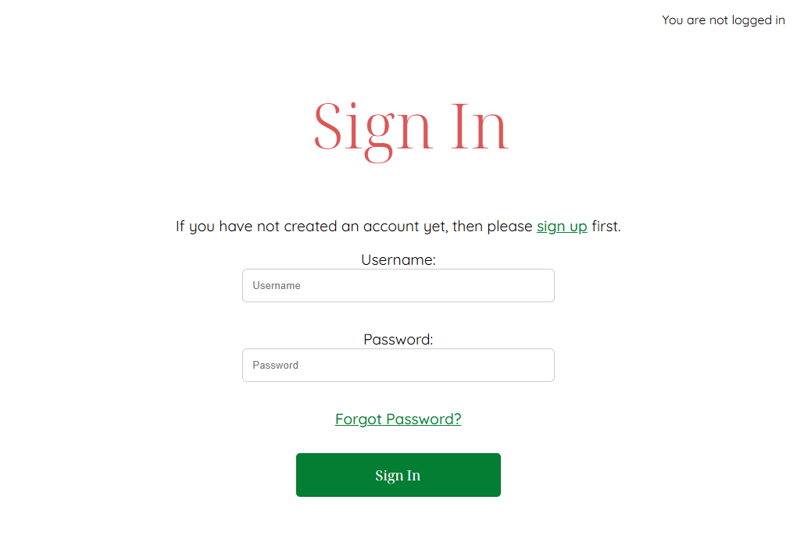

- Menu Browsing: Allows users (Logged in or not) to browse available dishes, see descriptions and price.
Notes: Responsive table layout ensures usability on mobile and desktop.

- Table Booking: Guests can book a table selecting date, time, number of people and optionally add a special request.
Notes: Prevents overbooking by controlling time slots and max capacity.
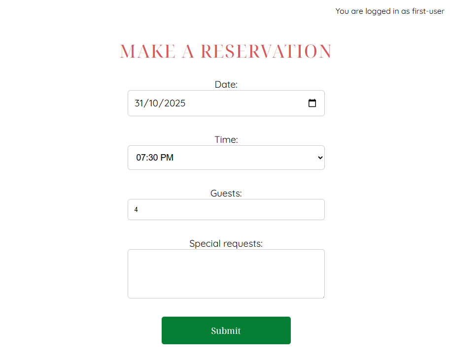

- Guest Dashboard: Allows guests to view, edit, or cancel existing reservations.
Notes: Users can only access their own reservations; attempting to access another user’s dashboard will show a custom 404 page..

- Staff / Admin Menu Dashboard: Allows staff to manage menu items, including adding new items, editing the name, description, price, category, or availability (making seasonal product rotation easier), and deleting items.
Notes: Role-based access ensures that only authorized users can modify data.

- Staff / Admin Reservations Dashboard: Allows staff to manage reservations, including editing them and updating their status (Confirm, Pending, Cancel).
Notes: Editing a reservation will redirecting you to the pre-filled form the user filled. 

- Custom 404 Page: Provides a user-friendly error page when a guest or staff member tries to access a resource they are not authorized to view. Enhances UX and prevents exposure of restricted content.
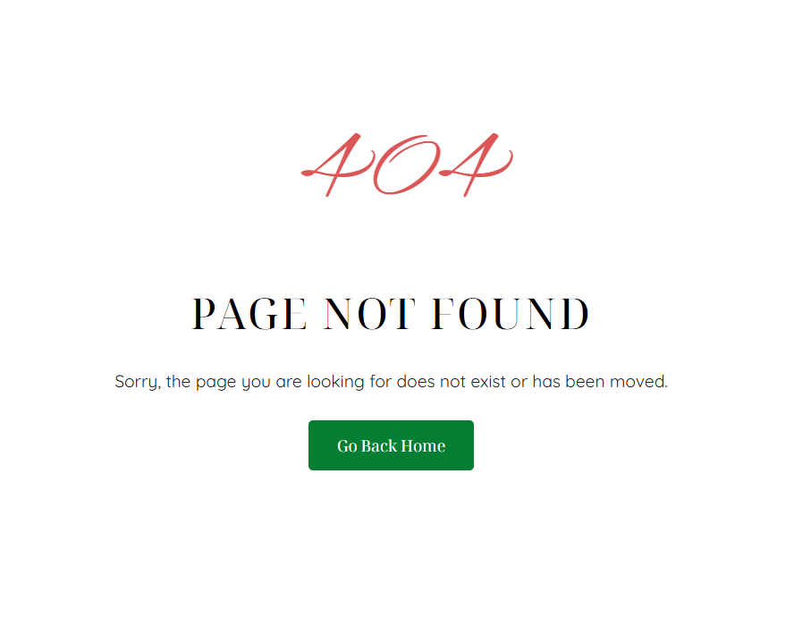

- Contact Page: Displays contact information for the restaurant. Users can send inquiries or view location, phone, and email.
Notes: Enhances accessibility and engagement with guests.

- Footer: Provides site-wide links and essential information.
Notes: Improves navigation and consistency across pages.

## 4. Planning

This project was planned and managed using Agile methodology. The development process was structured around user stories, epics, and sprints, ensuring incremental progress and flexibility to incorporate feedback.

In the initial stages, a paper wireframe was created to plan the layout and user flow of the home page. This wireframe was then translated into a basic HTML template, which served as the foundation for the full website design.
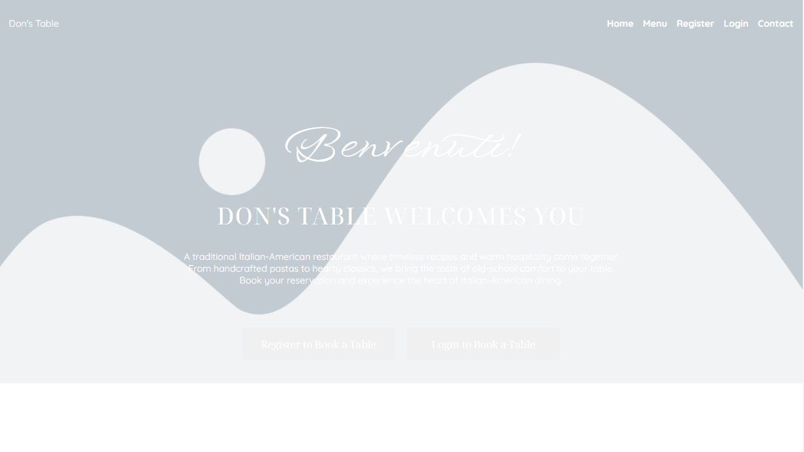

### 4.1 User Stories

All user stories are documented in the Agile tool linked to this project. Each story includes detailed acceptance criteria and associated tasks. There are 14 user stories in total, and all have been completed.

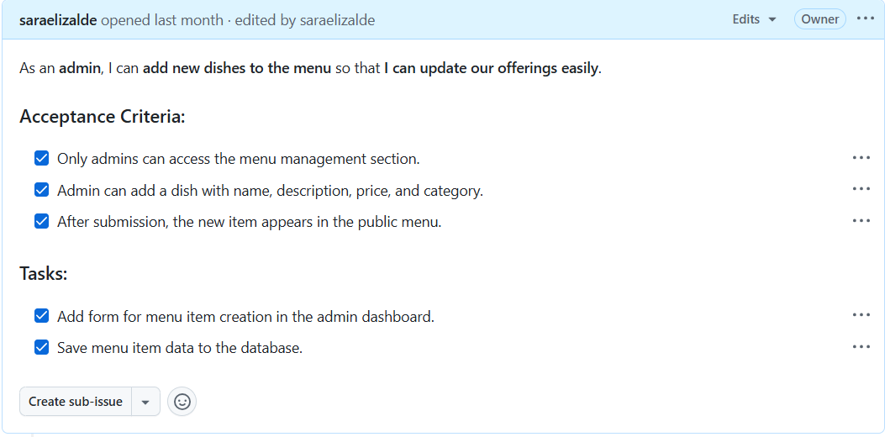

### 4.2 Epics

Three epics were created to organize and plan this project:

### 4.3 Sprints

Four Sprints were created to organize and plan this project:

     - Sprint 1: Project Setup & Core Models
         - Initialize project repository and environment
         - Configure authentication system (registration, login, logout)
         - Create models:
             - User 
             - Reservation
             - MenuItem
         - Set up Django built-in admin panel
             - Register models in the admin panel
             - Add basic permissions for admin access
         - Start base layout: navigation bar, footer, basic styling

     - Sprint 2: Menu Display & User Dashboard
         - Public menu page (anyone can view)
             - Display menu items grouped by category
             - Responsive layout
         - User dashboard (only for authenticated users)
             - Show upcoming reservations
             - Fallback message when no reservations found
         - Add links in navigation to login, register, dashboard, and menu

     - Sprint 3: Reservation System
         - Reservation form (for authenticated users only)
             - Date, time, number of guests
             - Validate against total capacity
         - Save reservation to database and mark as pending
         - Show confirmation or availability error message
         - Allow users to:
             - Edit reservations (with pre-filled form)
             - Cancel reservations
         - Display updated status in dashboard

     - Sprint 4: Final Touches & Documentation
         - Polish UI: spacing, typography, mobile responsiveness
         - Add error/success messaging
         - Final testing: forms, dashboard, availability logic
         - Write README

### 4.4 Database Diagram
To plan the relationships between my models, I created the following database diagram.
 - User (Django built-in)
 
 - Reservation
 
 -ModelItem
 

### 4.5 Project Structure

The project was initially organized to maintain a clear and scalable folder structure. Some changes were made during development, such as renaming files and adding new templates.
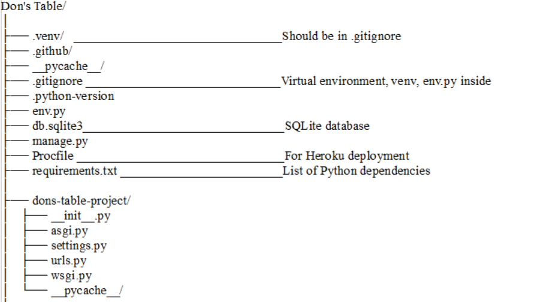
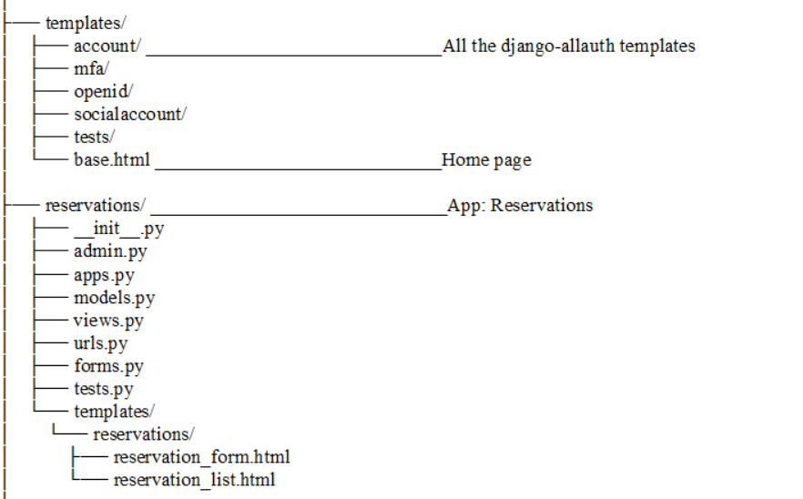
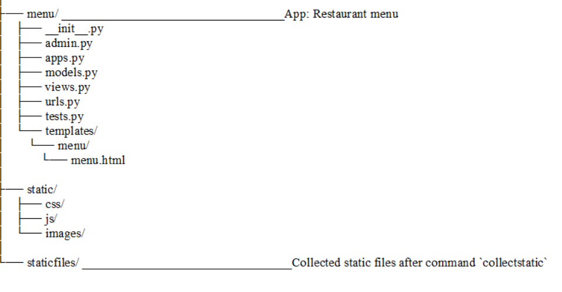

### 4.6 Views, URLs, and Templates

To structure the application efficiently, I mapped out all views, their corresponding URLs, and templates before implementation. This planning ensured that each user type (guest, staff, admin) had access to the correct pages and functionality, and that templates were reused where possible to maintain a consistent design. It also helped identify where Django generic views could simplify CRUD operations and improve maintainability.
